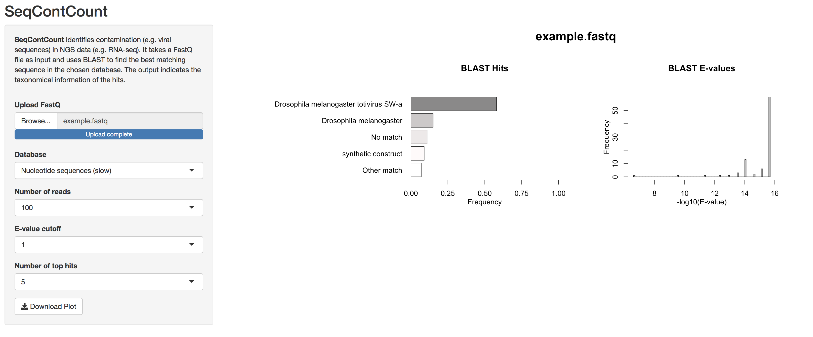

## SeqConCount

This app counts contaminating sequences in fastq files. It uses BLAST and the NCBI nucleotide database to find taxonomy/organism information for sequencing reads.

* Input: raw fast file
* Output: plot about species occurrence

## Installation

### Download app
* Download/clone repository
* e.g. create a new Rproject using version control in RStudio 

### Setup BLAST
* Download and extract BLAST (tested on Mac)
```
wget ftp://ftp.ncbi.nlm.nih.gov/blast/executables/blast+/2.10.0/ncbi-blast-2.10.0+-x64-macosx.tar.gz
tar -zxf ncbi-blast-2.10.0+-x64-macosx.tar.gz
```
* Copy ```blastn``` executable to the app directory

### Setup databases
* Download the following databases:
```
wget ftp://ftp.ncbi.nlm.nih.gov/blast/db/nt*.gz
wget ftp://ftp.ncbi.nlm.nih.gov/blast/db/taxdb.tar.gz
wget ftp://ftp.ncbi.nlm.nih.gov/blast/db/ref_viruses_rep_genomes.tar.gz
wget ftp://ftp.ncbi.nlm.nih.gov/blast/db/ref_prok_rep_genomes.*.tar.gz
```
* Extract database files:
```
for file in *.tar.gz; do tar -zxf "$file"; done
```
* Copy database files to the app directory


## Run app
* Run app from RStudio

## Example




